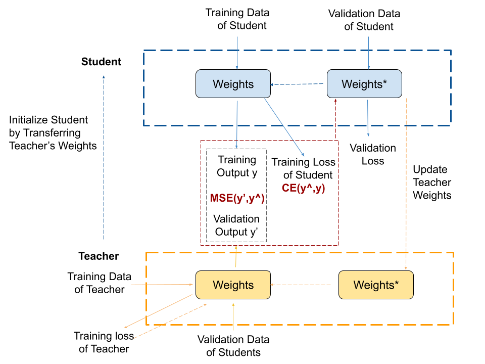

# LBT-BERT
Learning by Teaching, with Application to Text Classification Pytorch Implementation.
## Algorithm

## Implementation Referencing 
1. "Improving BERT Fine-Tuning via Self-Ensemble and Self-Distillation" 
    paper: https://arxiv.org/pdf/2002.10345.pdf
    pytorch implementation: https://github.com/lonePatient/BERT-SDA
2. "Learning by Teaching, with Application to Neural Architecture Search"
    papaer: https://arxiv.org/abs/2103.07009

## How to run code
1. Creat a folder "LBT-BERT" and download ./run_classifier.py from this repo
2. Create a new folder "bert_base_uncased" under "LBT-BERT" and download pre-trained BERT-BASE model to "bert_base_uncased" folder
<pre>
https://huggingface.co/bert-base-uncased
- pytorch_model.bin
- config.json
- vocab.txt
</pre>
3. Download Fine-Tuning Pytorch implementation to "LBT-BERT" folder
<pre>
git clone https://github.com/lonePatient/BERT-SDA.git
</pre>
4. Create a "SST_output/bert_base_uncased" folder under outputs to store model result
5. Create a "data" folder under "LBT-BERT" and download dataset to "LBT-BERT/data"
<pre>
https://gluebenchmark.com/tasks
SST-2
- train.tsv
- dev.tsv
- test.tsv
</pre>
6. Change the CURRENT_DIR to "LBT_BERT" and run following code.
<pre>
CURRENT_DIR=`pwd`
export BERT_BASE_DIR=$CURRENT_DIR/bert_base_uncased
export GLUE_DIR=$CURRENT_DIR/data
export OUTPUR_DIR=$CURRENT_DIR/outputs
TASK_NAME="SST"

python run_classifier.py \
  --model_type=bert \
  --model_name_or_path=$BERT_BASE_DIR \
  --task_name=$TASK_NAME \
  --do_train \
  --do_eval \
  --do_kd \
  --do_lower_case \
  --data_dir=$GLUE_DIR \
  --max_seq_length=128 \
  --per_gpu_train_batch_size=32\
  --per_gpu_eval_batch_size=32 \
  --learning_rate=2e-5 \
  --num_train_epochs=6 \
  --logging_steps=500 \
  --save_steps=500 \
  --output_dir=$OUTPUR_DIR/${TASK_NAME}_output/ \
  --overwrite_output_dir \
  --seed=42 \
  --kd_coeff=0.45\
  --eval_all_checkpoints
</pre>